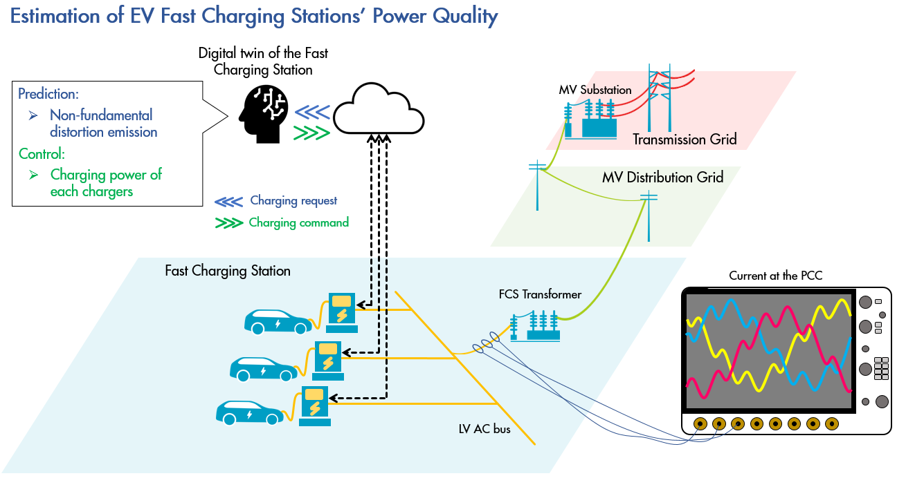
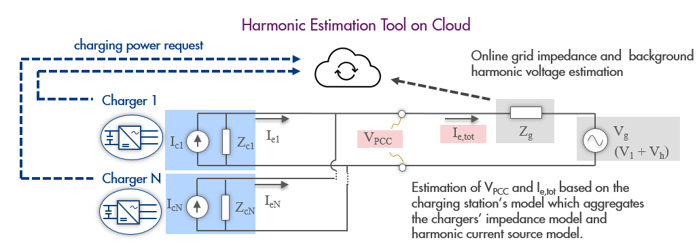

# Harmonic-Emission-Estimation Tool for Fast-DC-EV-chargers
## Background##
Fast charging stations (FCSs) are crucial for the rollout of Electric Vehicles (EVs). However, they, as a power-electronic based non-linear load, have impact on the power quality of the grid. To maintain the compatibility of the power grid with the upcoming massive introduction of FCSs, we need to investigate the potential power quality problems induced by the DC fast chargers. Among all the power quality issues, the harmonic emission noncompliance is one of the most important problems possibly induced by FCSs. 

The harmonic emission estimation tool is thereby developed to provide a cloud based web app that can be used to
- estimate the harmonic emission of a charging station at the design stage when the chargers' design specifications are known,
- estimate the harmonic emission of a charging station at the design stage when the chargers' design specifications are unknown but the chargers' impedance and harmonic current source is measured at certain charging power,
- and estimate the harmonic emission online when the charging station is operating.

The concept of the tool is illustrated below.

  

The corresponding impedance based model of the concept is illustrated below, where
* Ici is the harmonic current source of the charger i,
* Zci is the impedance of the charger i,
* Iei is the harmonic emission of the charger i,
* VPCC is the voltage at the point-of-common-coupling (PCC),
* Ie,tot is the harmonic emission of the FCS, 
* Zg is the grid impedance
* Vg is the grid voltage which consists of the fundamental voltage (i.e., V1) and the harmonic voltages (i.e., Vh)

  

## Impedance model of DC fast chargers##
The impedance model of DC fast chargers is essten
## References##